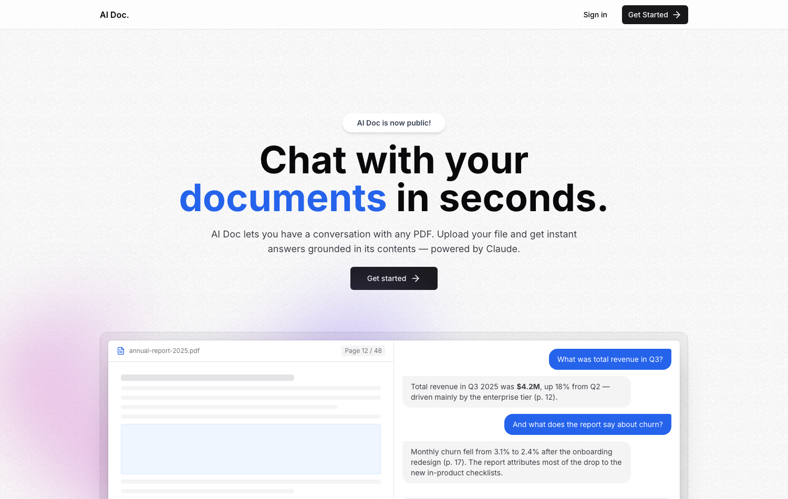

# AI Doc — Chat with your PDF documents

AI Doc is a full-stack SaaS application that lets you **have a conversation with any PDF**. Upload a document, and ask questions in natural language — every answer is generated by Claude and grounded in the actual contents of your file using Retrieval-Augmented Generation (RAG).



## How it works

```
Upload PDF ──▶ extract text ──▶ split into chunks ──▶ embed (Voyage AI)
                                                          │
                                                 store vectors (pgvector)
                                                          │
Ask a question ──▶ embed question ──▶ cosine similarity search (top-k chunks)
                                                          │
                                       Claude answers from those chunks,
                                       streamed token-by-token to the UI
```

1. **Ingestion** — when a PDF is uploaded (UploadThing), the server extracts its text, splits it into ~1,000-character overlapping chunks, embeds each chunk with Voyage AI (`voyage-3.5`, 1024-dim), and stores the vectors in Postgres via the `pgvector` extension.
2. **Retrieval** — each question is embedded with the same model, and the closest chunks for that file are found with pgvector's cosine-distance operator (`<=>`).
3. **Generation** — the retrieved chunks are passed as context to **Claude** (via the Vercel AI SDK), which streams a grounded answer back to the chat UI. If the answer isn't in the document, the assistant says so instead of hallucinating.
4. **Persistence** — files, chunks, and full chat history are stored per-user in Postgres; conversations survive refreshes and re-logins.

## Features

- 🔐 **Authentication** — sign up / sign in with Kinde; every file and conversation is scoped to its owner
- 📄 **PDF upload** — drag-and-drop upload with processing status (`PENDING → PROCESSING → SUCCESS/FAILED`)
- 🧠 **RAG chat** — answers grounded in *your* document, with streaming responses
- 🖥️ **Split-view workspace** — in-browser PDF viewer (zoom, rotate, page navigation) beside the chat
- 💾 **Persistent history** — full message history per document
- 🎨 **Modern UI** — Next.js App Router, Tailwind CSS, shadcn/ui-style components

## Tech stack

| Layer | Technology |
|---|---|
| Framework | [Next.js 14](https://nextjs.org) (App Router, TypeScript) |
| Auth | [Kinde](https://kinde.com) |
| Database | [Neon](https://neon.tech) Postgres + [pgvector](https://github.com/pgvector/pgvector), [Prisma](https://prisma.io) ORM |
| File storage | [UploadThing](https://uploadthing.com) |
| Embeddings | [Voyage AI](https://voyageai.com) (`voyage-3.5`) |
| LLM | [Claude](https://claude.com) (Anthropic) via the [Vercel AI SDK](https://sdk.vercel.ai) |
| UI | Tailwind CSS, shadcn/ui-style components, TanStack Query, react-pdf |

## Getting started

### 1. Clone and install

```bash
git clone https://github.com/Gutta09/Ai-Doc.git
cd Ai-Doc
npm install --legacy-peer-deps
```

### 2. Configure environment

Copy `.env.example` to `.env` and fill in each value:

- **Kinde** — create a free app at [kinde.com](https://kinde.com); set the callback URL to `http://localhost:3000/api/auth/kinde_callback` and logout URL to `http://localhost:3000`
- **Neon** — create a free Postgres project at [neon.tech](https://neon.tech) (pgvector is available out of the box); copy both the pooled (`DATABASE_URL`) and direct (`DIRECT_URL`) connection strings
- **UploadThing** — create a free app at [uploadthing.com](https://uploadthing.com) and copy the token
- **Voyage AI** — get an API key at [voyageai.com](https://voyageai.com)
- **Anthropic** — get an API key at [console.anthropic.com](https://console.anthropic.com)

### 3. Set up the database

```bash
npx prisma migrate dev --name init
```

This enables the `vector` extension and creates the `User`, `File`, `Message`, and `Chunk` tables.

### 4. Run it

```bash
npm run dev
```

Open [http://localhost:3000](http://localhost:3000), sign up, upload a PDF, and start asking questions.

## Deployment

The app deploys directly to [Vercel](https://vercel.com):

1. Import the repo in Vercel
2. Add all the environment variables from `.env.example`
3. Run `npx prisma migrate deploy` against the production database (or let the first deploy run it via a build hook)

> **Cost notes:** the chat route defaults to `claude-sonnet-5`; set `ANTHROPIC_MODEL=claude-opus-4-8` for maximum answer quality (or `claude-haiku-4-5` for minimum cost). Built-in guards: 30 messages/user/hour, 150 pages and 500 chunks max per PDF.

## Project structure

```
src/
├── app/
│   ├── page.tsx                       # Landing page
│   ├── auth-callback/                 # Post-login user sync
│   ├── dashboard/                     # File list + per-file chat workspace
│   └── api/
│       ├── auth/[kindeAuth]/          # Kinde auth handler
│       ├── uploadthing/               # Upload + ingestion pipeline
│       ├── files/                     # File CRUD + message history
│       └── message/                   # RAG chat endpoint (streaming)
├── Components/                        # UI components (chat, dashboard, viewer)
├── db/                                # Prisma client singleton
└── lib/                               # PDF parsing, Voyage embeddings, utils
prisma/schema.prisma                   # Data model (incl. pgvector column)
```

## Tests

```bash
npm test          # vitest — embedding client (batching, ordering, errors), chunking, request validation
npm run typecheck # tsc --noEmit
```

CI runs lint, typecheck, tests and a production build on every push.

## Attribution

This repo started from a Next.js UI scaffold by [Sathwik Batta](https://github.com/sathwikcodes) (2023–24).
The working product on top of it — the RAG pipeline (PDF ingestion, chunking, Voyage embeddings,
pgvector retrieval), the Claude streaming chat backend, per-user data scoping, message persistence,
rate limiting, and the current chat UI — was designed and built by [Bhargav Gutta](https://github.com/Gutta09) (2026).

## License

This project is licensed under the [MIT License](LICENSE).
